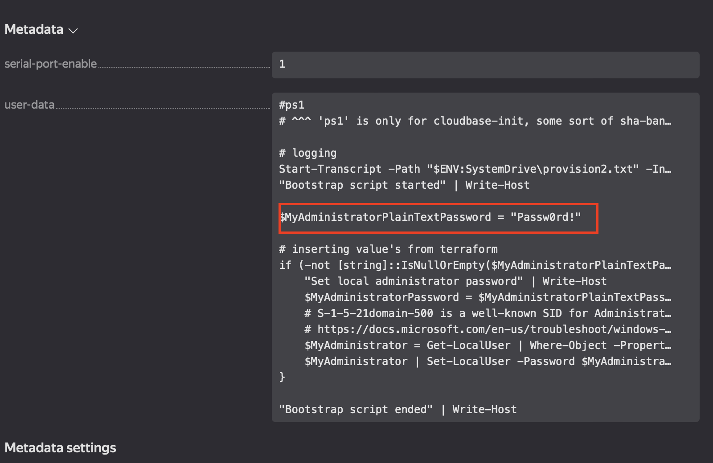
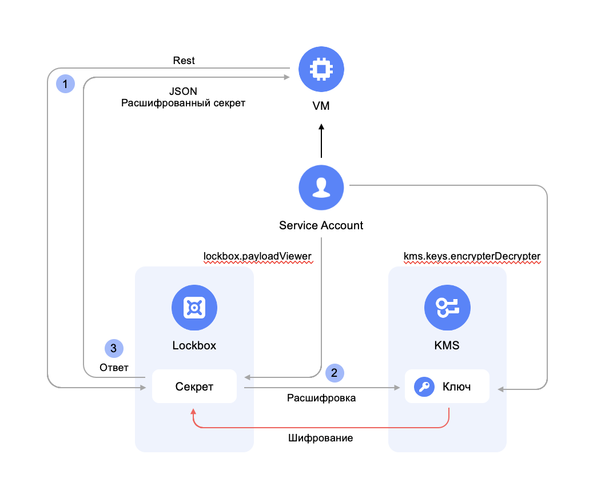
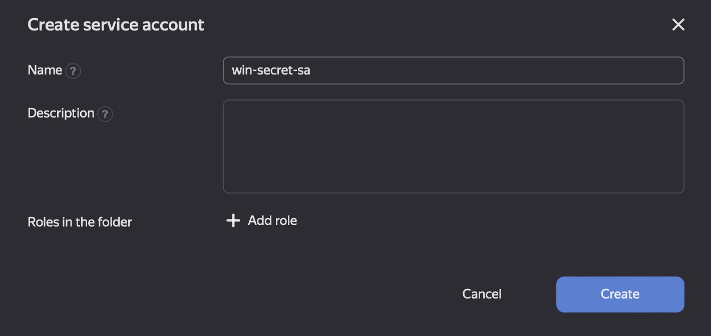
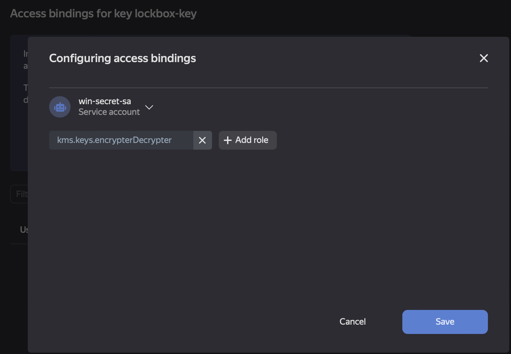
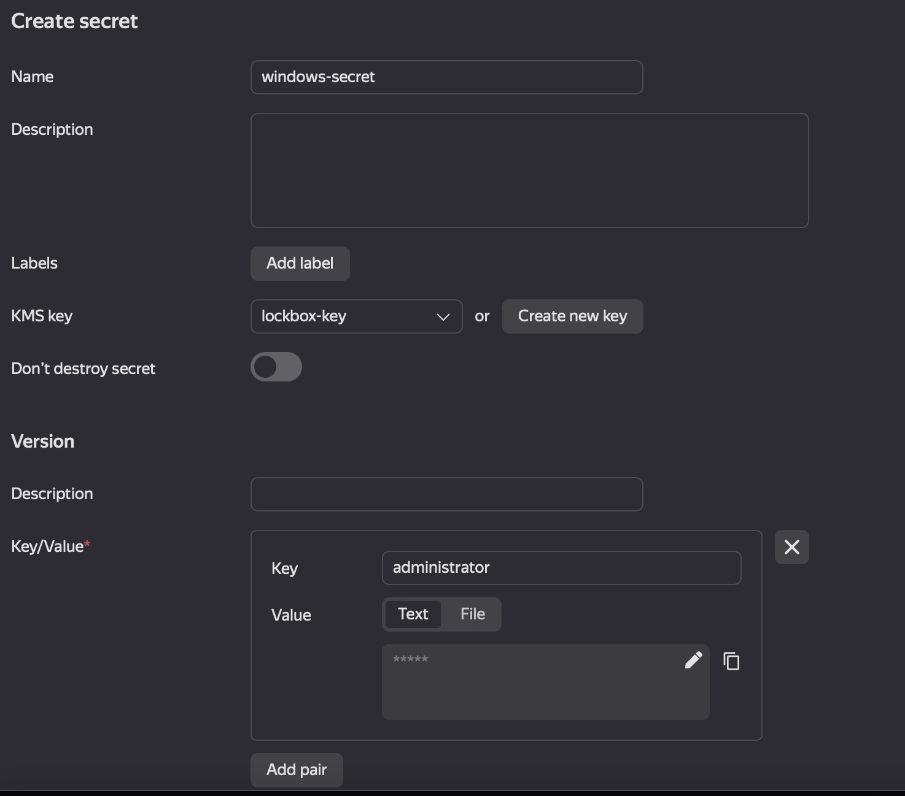
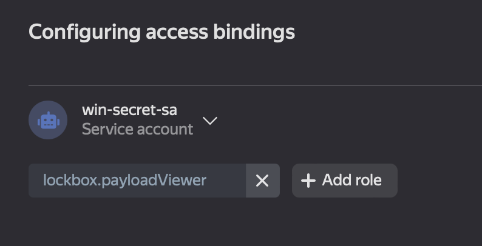
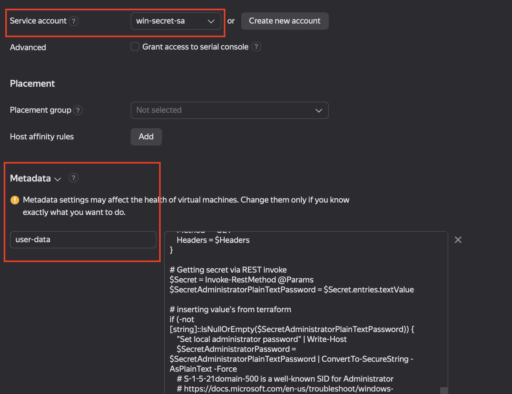
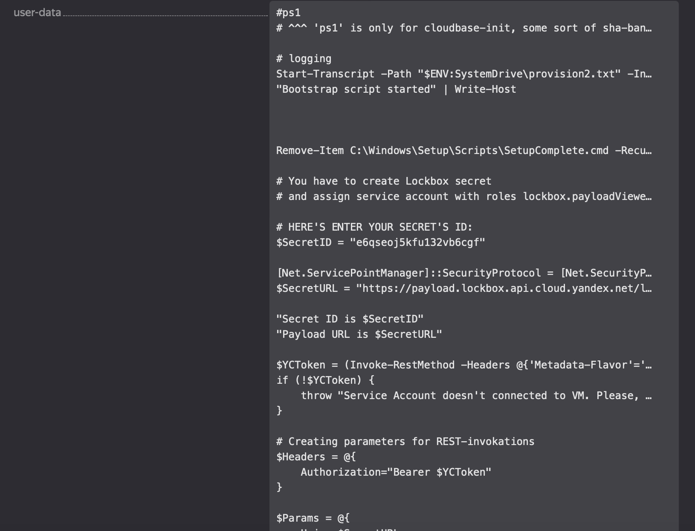

# YC Windows VM: Safely transmitting passwords into an initialization script

## Issue
By default, administrators can read any metadata transmitted to a VM. That said, sometimes, you do not want your cloud container administrators to have access to the guest OS. Here is an example of such a situation:



To securely transmit and store secrets (passwords and private keys) to a guest OS through the metadata service, we recommend utilizing an initialization script via Lockbox.

## Solution
A service account assigned to a VM can authenticate and authorize to IAM from within a guest OS in a simplified way: all you need to do is get an IAM token via `yc cli` or REST API without providing any information about the subject. This is how you can safely transmit a key-value pair (secret part) from Lockbox to the guest OS using a service account with the minimum required permissions. 



### 1. Create a service account
At the folder level, on the `Service Accounts` tab, let's create a service account for your script to access KMS and Lockbox.



Note that we do not assign any roles at this step, as folder-level roles will make that service account able to access all keys and secrets in the folder.

### 2. Create a KMS key
Create a KMS key; on its **Access Bindings** tab, assign the `kms.keys.encrypterDercrypter` role to the service account.



With a key-level role, a service account is granted granular access to operations on a specific key.

### 3. Create secrets in Lockbox
Let's create a secret, providing our encryption key.



A single secret can contain multiple key-value pairs, each being login and password for a user. By default, the local administrator must be listed first; other users will be iteratively created, with minimum OS permissions.

On the **Access Bindings** tab, let's assign the `lockbox.payloadViewer` role to the service account:



### 4. Create a VM
Let's create the `init.ps1` file with the contents as follows:

```PowerShell
#ps1
# ^^^ 'ps1' is only for cloudbase-init, some sort of sha-bang in linux

# logging
Start-Transcript -Path "$ENV:SystemDrive\provision2.txt" -IncludeInvocationHeader -Force
"Bootstrap script started" | Write-Host

# You have to create Lockbox secret 
# and assign service account with roles lockbox.payloadViewer and kms.key.encryptorDecryptor to VM

# HERE'S ENTER YOUR SECRET'S ID OF IMPORT FROM TERRAFORM VARIABLE:
$SecretID = "<YOUR_LOCBOX_SECRET_ID>"

[Net.ServicePointManager]::SecurityProtocol = [Net.SecurityProtocolType]::Tls12
$SecretURL = "https://payload.lockbox.api.cloud.yandex.net/lockbox/v1/secrets/$SecretID/payload"

"Secret ID is $SecretID"
"Payload URL is $SecretURL"

$YCToken = (Invoke-RestMethod -Headers @{'Metadata-Flavor'='Google'} -Uri "http://169.254.169.254/computeMetadata/v1/instance/service-accounts/default/token").access_token
if (!$YCToken) {
    throw "Service Account doesn't connected to VM. Please, add Service account with roles lockbox.payloadViewer and kms.key.encryptorDecryptor to VM and try again."
}

# Creating parameters for REST-invokations
$Headers = @{
    Authorization="Bearer $YCToken"
}

$Params = @{
    Uri = $SecretURL
    Method = "GET"
    Headers = $Headers
}

# Getting secret via REST invoke
$Secret = Invoke-RestMethod @Params
$SecretAdministratorPlainTextPassword = $Secret.entries[0].textValue

# Inserting value's from terraform
if (-not [string]::IsNullOrEmpty($SecretAdministratorPlainTextPassword)) {
    "Set local administrator password" | Write-Host
    $SecretAdministratorPassword = $SecretAdministratorPlainTextPassword | ConvertTo-SecureString -AsPlainText -Force
    # S-1-5-21domain-500 is a well-known SID for Administrator
    # https://docs.microsoft.com/en-us/troubleshoot/windows-server/identity/security-identifiers-in-windows
    $Administrator = Get-LocalUser | Where-Object -Property "SID" -like "S-1-5-21-*-500"
    $Administrator | Set-LocalUser -Password $SecretAdministratorPassword
}

# Creating new users if any
if($Secret.entries.count -gt 1) {
    foreach($User in $Secret.entries[1..($Secret.entries.count-1)]){
        $SecretUserPassword = $User.textValue | ConvertTo-SecureString -AsPlainText -Force
        New-LocalUser -Name $User.key -Password $SecretUserPassword -FullName $User.key
        Add-LocalGroupMember -Group Users -Member $User.key
        Add-LocalGroupMember -Group "Remote Desktop Users" -Member $User.key
    }
}

"Bootstrap script ended" | Write-Host
```

Assign the ID of your new Lockbox secret to the `$SecretID` variable. Since the ID of a secret is not the secret itself, it is not sensitive information.

**Creating a VM through YC CLI:**

```Bash
yc compute instance create --name <vm_name> --hostname <guest os name> --zone ru-central1-a --create-boot-disk image-id=<imade_id> --cores 2 --core-fraction 100 --memory 4 --metadata-from-file user-data=init.ps1  --network-interface subnet-name=<subnet name>,nat-ip-version=ipv4 --service-account-name <service_account_name> --platform standard-v3
```

**Creating a VM the UI:**

Within the UI, you can provide your initialization script in `user-data`. To do this, enter `user-data` in the `key` field and paste your script to the `Value` field.


### 5. Check the result
Now, your VM metadata does not contain any sensitive data:


